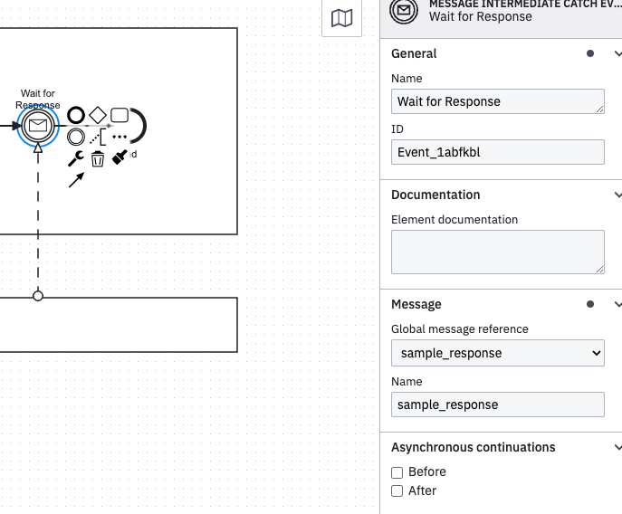
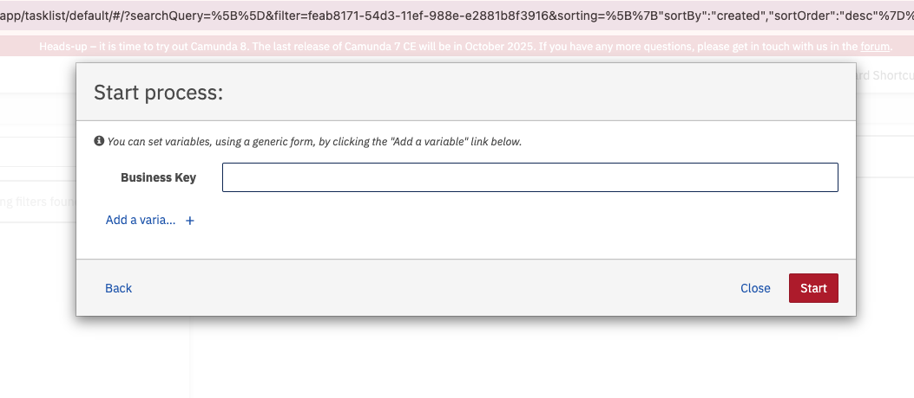
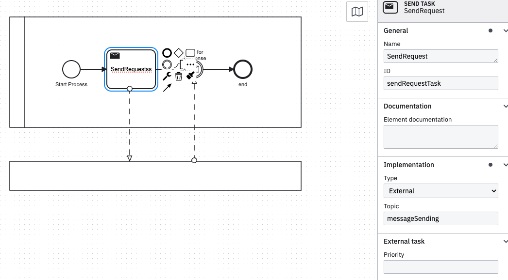

## Conception for Correlation Message

### Abstract Concept
```mermaid
sequenceDiagram
    User->>+CamundaEngine: Start Process
    CamundaEngine->>+PythonPod: Subscribe to Activity Message Topic
    PythonPod->>+CamundaEngine: Complete Activity 
    CamundaEngine->>-CamundaEngine: Runs Process
    PythonPod->>+CamundaEngine: Notify async Message Correlation Message
    CamundaEngine->>-CamundaEngine: complete process
```
Your engine's workers are currently capable of executing specific tasks.
To mitigate potential timeouts caused by unexpectedly long-running tasks, you can leverage the message correlation feature. This mechanism suspends the process until a notification is received, preventing bottlenecks.

The Camunda Engine REST API requires the following dependency for activationin Spring Boot [Rest API Depdency](https://docs.camunda.org/manual/7.21/user-guide/spring-boot-integration/rest-api/)

Follwing Example is feasable to write a message to the camunda server: [Documentation Message Correlation Rest Api](https://docs.camunda.org/rest/camunda-bpm-platform/7.21/#tag/Message):

Your request JSON for the correclation feature must include at least the following fields:

```json
{
  "messageName": "aMessage",
  "businessKey": "aBusinessKey",
}
```

the `messageName` should be the name of your camunda Message Intermediate Catch Event as in our example here



The business key is a unique identifier that you will generate in the UI for your task.

for example:


To listen to the task in Camunda please use following references [create external task lib](https://github.com/camunda-community-hub/camunda-external-task-client-python3)

```python
from camunda.external_task.external_task import ExternalTask, TaskResult
from camunda.external_task.external_task_worker import ExternalTaskWorker
```

To subscribe to the task, use following snipped:

```python
ExternalTaskWorker(worker_id="1", config=default_config).subscribe("topic", handle_task)
```

the `topic` should be the name, you assign in your activity. for our example we use `messageSending`


The callback function which handle the task can looked like this:

```python
def handle_task(task: ExternalTask) -> TaskResult:
    key = task.get_business_key()
    print("create task event")
    return task.complete({"var1": 1, "var2": "value"})
```

This handler will listen to the external task api, if the process is running. if a process runs this will intercept and will go further.
if you need more logic, please put in in here.

This event will then stuck in the MessageEventListener, until it gets a notification, that it can run further.
To archive it, you can use following snipped:

```python
def sendTaskResponse(businessKey):

    print("using businesskey", businessKey)
    time.sleep(2)
    url = "http://localhost:8080/engine-rest/message"
    data = {"businessKey": businessKey, "messageName": "sample_response"}
    print("used url is " ,url)
    print("used json data is ", data)
    response = requests.post(url, headers={'Content-Type': 'application/json'}, json=data)

    if response.status_code == 204:
        print("Request successful")
        print(response)
    else:
        print("Request failed")
        print(response)
```

Normally, the Camunda REST API endpoint for sending messages is located at `/engine-rest/message`. The server expects a `POST` request with appropriate parameters.
As mentioned earlier, you'll require both the `businessKey` and the correct `messageName` for this operation.

To execute it in our script asynchronous to you can following adition to the `handle_task`:

```python
def handle_task(task: ExternalTask) -> TaskResult:
    key = task.get_business_key()

    print("business key from task event", key)
    # create a seperated thread for sendTaskResponse in
    e = threading.Event()
    t1 = threading.Thread(target=sendTaskResponse, args=[key])
    t1.start()
    print("create task event")

    return task.complete({"var1": 1, "var2": "value"})
```
